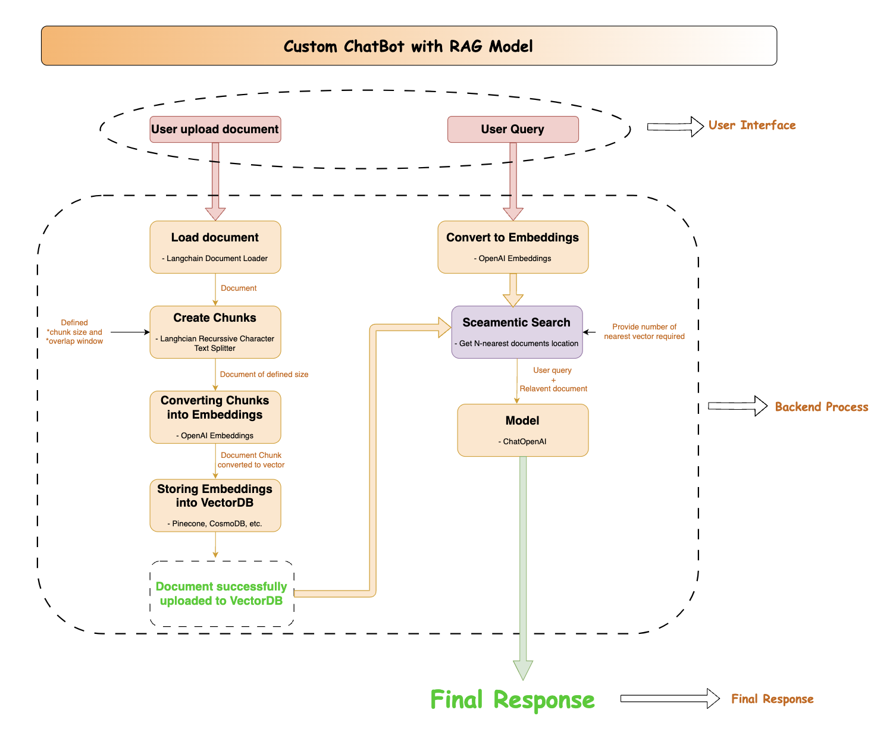

# Custom Chatbot using Streamlit

This project implements a custom chatbot using Streamlit, integrating document indexing and retrieval functionalities using Pinecone and language model capabilities from OpenAI.


## Features

- **Upload PDF Documents**: Users can upload PDF documents to be indexed and utilized by the chatbot for answering queries.
- **Document Indexing**: Uploaded documents are indexed and stored using Pinecone, enabling efficient retrieval based on user queries.
- **Chatbot Interface**: Users can input queries through a text area and receive answers from the chatbot.
- **Similar Document Retrieval**: The chatbot retrieves relevant documents based on the user query and presents answers from those documents.
- **Responsive UI**: The Streamlit interface provides an interactive and user-friendly experience.

## Technologies Used

- **Streamlit**: For building the web application interface.
- **Pinecone**: For indexing and retrieval of documents.
- **OpenAI**: For language model capabilities used in generating responses.
- **Python**: Programming language used for backend development.
- **PDF Miner**: For extracting text from PDF documents.
- **UUID**: For generating unique identifiers for document indexing.

## Workflow



## Installation

1. Clone the repository:

   ```
   git clone https://github.com/AnkitBaliyan1/st-RAG-custom-chatbot/
   cd custom-chatbot
   ```

2. Install dependencies:

   ```
   pip install -r requirements.txt
   ```

3. Set up environment variables:
   - Create a `.env` file in the root directory.
   - Define the following environment variables:
     - `OPENAI_API_KEY`: Your OpenAI API key.
     - `PINECONE_API_KEY`: Your Pinecone API key.
     - `PINECONE_INDEX_NAME`: Name for the Pinecone index.

## Usage

1. Run the Streamlit application:

   ```
   streamlit run app.py
   ```

2. Upload PDF documents using the file uploader in the sidebar.
3. Click on "Push for bot to learn" to index the uploaded documents.
4. Enter your query in the text area and click "Get Answer" to receive a response from the chatbot.


## Acknowledgments

- Special thanks to the developers of Streamlit, Pinecone, and OpenAI for their excellent tools and APIs.


## Application Link

Check out the web Application here -> [link](https://customchatbot-byankit.streamlit.app)
